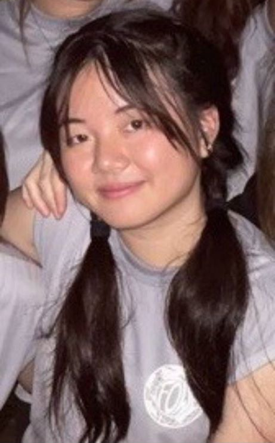
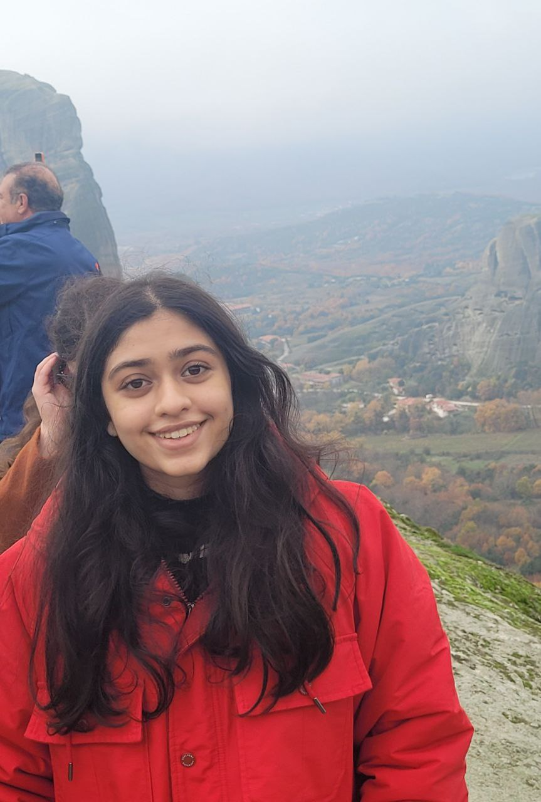

# About Us

We are a team based in the [School of Computing, National University of Singapore](http://www.comp.nus.edu.sg).

## Project team

### Ong Xinyi

[[github](https://github.com/ongxinyii)]

* Role: Developer
* Responsibilities: Documentation

### Chang Jia Yang

[[github](https://github.com/changjy81)]

* Role: Team Lead, Scheduling and Tracking

### Ngo Duc Anh

[[github](https://github.com/nikingoda)]

* Role: Developer

### Yuto Watanabe

[[github](https://github.com/yuto1115)]

* Role: Code Quality

### Sanya Sanghavi

[[github](http://github.com/sunpterodactyl)]

* Role: Developer
* Responsibilities: Integration
