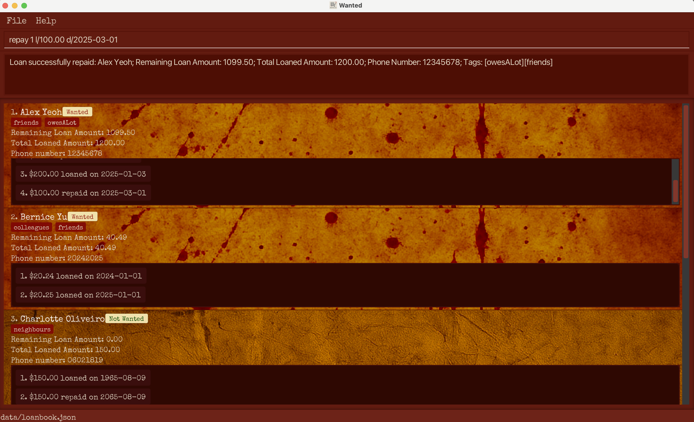
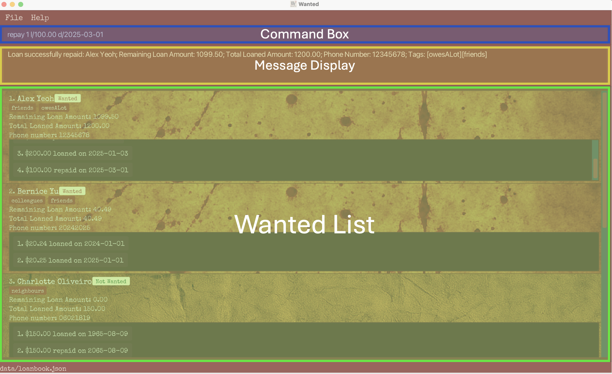
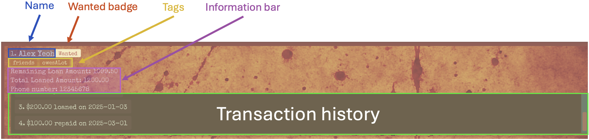
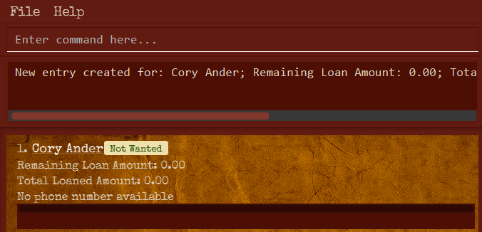
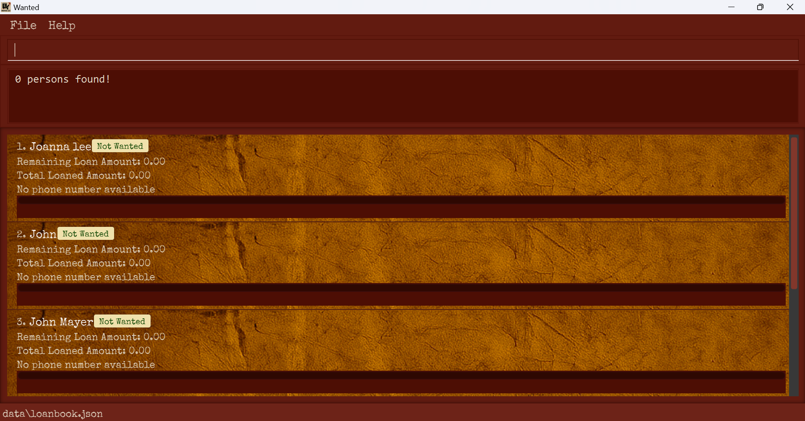

# Wanted User Guide

Wanted is a loan tracking application meant for personal use, for anyone who wants to keep track of these loans.

This guide assumes cursory knowledge of operating a Command Line Interface (CLI). 
In short, almost all actions in the program are performed by typing in a command in the specified formats below and pressing the Enter key.

This guide can be accessed from the project's Github page or the Help window of the application.

## Value Proposition
With Wanted, you can
1. Track monetary loans by name
2. Repay loans in small amounts
3. View transaction history of borrowing and repayment
4. Do this all in a gritty, fun interface that resembles a Wanted poster!

<!-- * Table of Contents -->
<page-nav-print />

## Table of Contents

1. [Quickstart](#quick-start)
2. [I want a brief overview! TL;DR](#tldr)
3. [User Interface](#user-interface)
4. [Command Summary](#command-summary)
5. [Features](#note-on-features)
    - **Set up**
        1. [Help](#help)<br>
        2. [Add](#add)<br>
    - **Edit an entry's details**<br>
        3. [Rename](#rename)<br>
        4. [Phone](#phone)<br>
        5. [Tag](#tag)
    - **Add or edit transactions**<br>
        6. [Increase](#increase)<br>
        7. [Repay](#repay)<br>
        8. [Edithist](#edithist)<br>
        9. [Delhist](#delhist)
    - **View your Wanted list**<br>
        10. [List](#list)<br>
        11. [Find](#find)<br>
        12. [Sort](#sort)
    - **Edit your Wanted list data**<br>
        13. [Delete](#delete)<br>
        14. [Clear](#clear)<br>
        15. [Exit](#exit)<br>
        16. [Save data](#saving-the-data)<br>
        17. [Backup data file](#backing-up-data-files)<br>
6. [Known Issues](#known-issues)


--------------------------------------------------------------------------------------------------------------------

## Quick Start

1. Ensure you have Java `17` or above installed in your Computer.<br>
   You can find a guide for how to install Java 17 on Windows [here](https://se-education.org/guides/tutorials/javaInstallationWindows.html).
   **Mac users:** Ensure you have the precise JDK version prescribed [here](https://se-education.org/guides/tutorials/javaInstallationMac.html).

2. Download the latest `.jar` file from [here](https://github.com/AY2425S2-CS2103T-F11-4/tp/releases).

3. Copy the file to the folder you want to use as the _home folder_ for Wanted. We recommend creating a new folder on your Desktop.

4. Open a command terminal. On Windows, this can be done by clicking the Windows button, typing `cmd` and selecting Command Prompt.

5. Use the `cd` command to navigate to the folder with `wanted.jar`. On Windows, if you have the folder containing `wanted.jar` open in File Explorer,
   you can right-click the folder name in the address bar near the top and select Copy Address, then type `cd`, a space, then Ctrl-V.

6. Run `java -jar wanted.jar` in the command terminal to run the application.<br>
   A GUI similar to the below should appear in a few seconds. Note how the app contains some sample data.<br>
   

5. Type the command in the command box and press Enter to execute it. e.g. typing `help` and pressing Enter will open the help window.<br>
   Some example commands you can try:

    * `add n/John Doe` : Adds a new borrower named `John Doe` to the Wanted list.

    * `increase 1 l/19.87 d/2024-12-10` : Increases the amount borrowed by the 1st person in the current list and records the transaction in its loan history.

    * `repay 2 l/20.25 d/2025-01-01` : Decreases the amount borrowed by the 2nd person in the current list and records the transaction in its loan history.

    * `delete 3` : Deletes the 3rd person shown in the current list.

    * `clear` : Deletes all persons.

    * `exit` : Exits the app.

6. Refer to the [Features](#features) below for details of each command.

--------------------------------------------------------------------------------------------------------------------

[//]: # (somehow normal markdown notation disables links to this section, so using html notation)
<h2 id="tldr">TL;DR</h2>

___How do I track a loan?___<br>
Use the <a href="#add">add</a> command to add the loanee’s name to the list, then use the <a href="#increase">increase</a> command to assign the amount loaned to that person’s entry.

___How do I track repayments?___<br>
Locate the loanee's entry in the list and use the <a href="#repay">repay</a> command.

___How do I find an entry that I want to modify?___<br>
If you remember the loanee’s name, use the <a href="#find">find</a> command to find the loan.
To organize your Wanted list, you can use <a href="#list">list</a> to arrange by name, or <a href="#sort">sort</a> to arrange by the remaining amount owed.

--------------------------------------------------------------------------------------------------------------------
## User Interface

#### Overview



The GUI of the Wanted app consists of three main components: **Command Box**, **Message Display**, and **Wanted List**.

* **Command Box**: This is where you type your commands.

* **Message Display**: When you execute a command (by typing and pressing Enter), the result will appear here.  
  This may include confirmation messages for successful commands or error messages if the input is invalid.

* **Wanted List**: This displays a list of **entries** currently stored in the app.  
  If the list exceeds the height of the screen, a scrollbar on the right allows you to scroll through it.

#### Entries



Each **entry** represents a person and displays their information along with their transaction history.  
An entry contains the following components:

* **Name**: Displays the name of the person. The number to the left indicates the index of the entry.

* **Wanted badge**: Indicates whether the person still owes you any money.  
  It shows `Wanted` if they owe you money, and `Not Wanted` otherwise.

* **Tags**: Displays a list of tags associated with the person.

* **Information bar**: Shows key details about the person, including Remaining Loan Amount, Total Loaned Amount, and phone number.
    * **Remaining Loan Amount** refers to the total amount the person still owes across all transactions.

    * **Total Loaned Amount** refers to the total sum loaned to the person across all transactions.

* **Transaction history**: Lists all transactions associated with the person.  
  Each transaction appears in one of the following formats:
    * `[amount] loaned on [date]` — Indicates that an amount was loaned on the given date.  
      Example: `$100.00 loaned on 2025-01-01`

    * `[amount] repaid on [date]` — Indicates that an amount was repaid on the given date.  
      Example: `$50.00 repaid on 2025-02-01`

  The number to the left of each transaction indicates its index within the transaction history.  

  If the transaction list exceeds the height of the display area, the most recent transactions (those with higher indices) are shown by default.  
  You can scroll upward using the scrollbar on the right to view older transactions.

<box type="tip" seamless>

**Tip**: The background image of an entry changes depending on whether the person is in the `Wanted` or `Not Wanted` status.<br>
</box>

--------------------------------------------------------------------------------------------------------------------

## Command Summary

Command     | Action                                   | Format
-----------|------------------------------------------|-------------------------------------------------------------------------------------------------------------------------------------------------------------
[**help**](#help)   | Show help window                         |`help`
[**add**](#add)    | Add new entry                            |`add n/[NAME]`
[**rename**](#rename) | Change name of entry                     | `rename [ID] n/[NAME]`
[**phone**](#phone) | Add/change phone number of entry         | `phone [ID] p/[PHONE]`
[**tag**](#tag) | Add/change tags of entry                 | `tag [ID] t/[TAG]…`
[**increase**](#increase) | Add a loan to entry                      | `increase [ID] l/[AMOUNT] d/[DATE]`
[**repay**](#repay) | Add a repayment to entry                 | `repay [ID] l/[AMOUNT] d/[DATE]`
[**edithist**](#edithist)   | Edit a transaction in entry              |`edithist [ID] i/[TRANSACTION ID] (l/[AMOUNT]) (d/[DATE])`
[**delhist**](#delhist) | Delete a transaction in entry            | `delhist [ID] i/[TRANSACTION ID]`
[**list**](#list)   | List entries in alphabetic order of name |`list`
[**sort**](#sort)   | Sort entries by loaned amount            |`sort`
[**find**](#find)   | Search entries by name                   |`find [KEYWORD]…`
[**delete**](#delete) | Delete an entry                          |`delete [ID]`
[**clear**](#clear)  | Delete all entries                       |`clear`
[**exit**](#exit)   | Exit the program                         |`exit`

--------------------------------------------------------------------------------------------------------------------

## Note on Features

<box type="info" seamless>

<span id="note-command-format"></span><big>**Notes about the command formats:**</big><br>

* Words in square brackets and `UPPER_CASE` are the parameters to be supplied by the user.<br>
  e.g. in `add n/[NAME]`, `[NAME]` is a parameter which can be used as `add n/John Doe`.

* All **command** keywords are **case-sensitive**.<br>
  e.g. `add n/[NAME]` cannot be used as `Add n/[NAME]` or `add N/[name]`.

* Items in round brackets are optional.<br>
  e.g `(t/[TAG])` can be used as ` ` (blank) or as `t/friend`.

* Items with `…` after them can be used multiple times.<br>
  e.g. `t/[TAG]…` can be used as `t/friend` or as `t/friend t/family`.

* Parameters can be in any order.<br>
  e.g. if the command specifies `l/[AMOUNT] d/[DATE]`, `d/[DATE] l/[AMOUNT]` is also acceptable.

* Extraneous parameters for commands that do not take in parameters (`help`, `list`, `sort`, `clear` and `exit`) will be ignored.<br>
  e.g. if the command specifies `help 123`, it will be interpreted as `help`.

* Extraneous whitespace before or after parameters will be ignored.<br>
  e.g. in `add n/[NAME]`, `add n/ John Doe ` will be interpreted as `add n/John Doe`.<br>
  Note that any whitespace within parameters are retained.

* If you are using a PDF version of this document, note that copying and pasting commands that span multiple lines may not work as intended as space characters surrounding line-breaks may be omitted.

<span id="restrictions"></span><big>**Restrictions on the parameters:**</big><br>

The parameters you provide must meet the following constraints, unless otherwise specified.<br>

Additionally, excessively long inputs or unusually large values may cause the app to behave unexpectedly.

If you encounter an error message indicating that your input is invalid and you're unsure how to correct it, refer to the table below along with the detailed explanations of each command further down.

Parameter  | Constraints                                                                                                    | Examples of **valid** input | Examples of **invalid** input
-----------|----------------------------------------------------------------------------------------------------------------|----------------------|-----
**ID** / **TRANSACTION ID**     | A positive integer                                                                                             | `1`, `2`, `3`        | `-1`, `0`, `1.2`
**NAME**   | Must contain only alphanumeric characters and spaces; cannot be blank                                          | `John`,<br>`John y3` | `John-Doe`, ` ` (blank)
**PHONE**  | Must contain only digits; at least 3 digits required                                                           | `12345678`, `000`    | `+65-12345678`, `00`
**TAG**    | Must contain only alphanumeric characters; cannot contain spaces or be blank                                   | `friend`, `year1`    | `best friend`, `year-1`,<br>` ` (blank)
**AMOUNT** | A non-negative numeric value with at least one digit before the decimal point and **exactly** two digits after | `123.45`, `5.30`, `0.00` | `$10.00`, `3`, `3.2`, `3.245`, `-1.00`, `.50`
**DATE**   | Must be in the `YYYY-MM-DD` format and represent a valid calendar date                                         | `2024-10-15`, `2025-01-01` | `2024-10`, `1st Jan 2025`, `2025-1-10`, `2025-01-50`
**KEYWORD**| Cannot contain spaces or be blank                                                                              | `John`, `john123+$/` | `John Doe`, ` ` (blank)

</box>

<h3 id="help">Viewing help: <code>help</code></h3>

This command displays a link to this User Guide for your reference.


**Format:** `help`

<h3 id="add">Adding an entry: <code>add</code></h3>

This command allows you to add a new person as a new entry to the Wanted list.<br>

**Format:** `add n/[NAME]`

(See [Notes about the command formats](#note-command-format) and [Restrictions on the parameters](#restrictions))

**Explanations:**
* This command adds a new entry with the specified `NAME`, starting with no loaned or repaid amount, no transaction history, no phone number, and no tags.
* `NAME` must not already exist in the Wanted list.

<box>

**Scenario 1:** Adding a new entry<br>

**Input:** `add n/Cory Ander`<br>

**Output:**
```output 
New loan created for: Cory Ander; Remaining Loan Amount: 0.00; Total Loaned Amount: 0.00; Phone Number: --------; Tags:
```
**Behaviour:**
You will see a new entry with the name Cory Ander, however take note the money loaned and the money to be returned will be initialised to zero.
The transaction history and tags will also be empty.

**Scenario 2:** Attempting to add an entry with an existing name in the Wanted list<br>
> **Note:** Assume Cory Ander exists at the first index.

**Input:** `add n/Cory Ander`<br>

**Output:**
```output 
This person has already loaned out money in the wanted list
```
**Behaviour:**
You will receive an error message.

</box>



<h3 id="rename">Renaming an entry: <code>rename</code></h3>

This commands allows you to change the name of the specified entry in the Wanted list.

**Format:** `rename [ID] n/[NAME]`

(See [Notes about the command formats](#note-command-format) and [Restrictions on the parameters](#restrictions))<br>

**Explanations:**
* This command allows you to modify the entry at the specified `ID`. The ID refers to the index number shown in the displayed Wanted list.
* If `NAME` is equal to the previous name or any other name in the Wanted list, the name will not be updated.

**Examples:**

<box>

**Scenario 1:** Renaming an entry<br>

**Input:** `rename 1 n/Cory Ander`<br>

**Output:**
```output 
Edited loan name: Cory Ander; Remaining Loan Amount: 1199.50; Total Loaned Amount: 1200.00; Phone Number: 12345678; Tags: [owesALot][friends] 
```
**Behaviour:**
The first entry will be renamed to Cory Ander.

**Scenario 2:** Attempting to rename an entry with the same name<br>
> **Note:** Assume Cory Ander exists at the first index.

**Input:** `rename 1 n/Cory Ander`<br>

**Output:**
```output 
New name must be different from the old one.
```
**Behaviour:**
You will receive an error message.

**Scenario 3:** Attempting to rename an entry with an existing name in the Wanted list<br>
> **Note:** Assume David Li exists at the second index.

**Input:** `rename 1 n/David Li`<br>

**Output:**
```output 
This person already exists in the wanted list.
```
**Behaviour:**
You will receive an error message.
</box>


<h3 id="phone">Adding/Updating phone number: <code>phone</code></h3>

This command allows you to add, change or delete a phone number for an entry in the Wanted list.

<box type="warning" seamless>

**Warning**: An empty phone number `p/` will clear the entry's phone number.
</box>

**Format:** `phone [ID] p/[PHONE]`

(See [Notes about the command formats](#note-command-format) and [Restrictions on the parameters](#restrictions))

**Explanations:**
* This command allows you to modify the entry at the specified `ID`. The ID refers to the index number shown in the displayed Wanted list.
* To add or change a phone number, `PHONE` must be non-empty and different from the current phone number (if exists).
* To delete a phone number, supply an empty `PHONE` (i.e. `phone [ID] p/`).

**Examples:**

<box>

**Scenario 1:** Adding a new phone number<br>

**Input:** `phone 1 p/98765432`<br>

**Output:**
```output 
Phone number successfully updated: Cory Ander; Remaining Loan Amount: 1199.50; Total Loaned Amount: 1200.00; Phone Number: 98765432; Tags: [owesALot][friends]
```
**Behaviour:**
The phone number of your first entry will be updated to `98765432`.

**Scenario 2:** Deleting a phone number<br>

**Input:** `phone 1 p/`<br>

**Output:**
```output
This loan now has no phone number: Cory Ander; Remaining Loan Amount: 1199.50; Total Loaned Amount: 1200.00; Phone Number: --------; Tags: [owesALot][friends]
```
**Behaviour:**
The phone number of your first entry will be deleted and instead displayed as `No phone number available`.

**Scenario 3:** Attempting to add multiple phone numbers<br>
> **Note:** This command will only be executed when there is one prefix `p/` in your input.

**Input:** `phone 1 p/98765432 p/`<br>

**Output:**
```output 
Multiple values specified for the following single-valued field(s): p/
```
**Behaviour:**
You will receive an error message.

**Scenario 4:** Attempting to update with the same phone number<br>
> **Note:** Assume the phone number of the second entry is initially `20242025`.

**Input:** `phone 2 p/20242025`<br>

**Output:**
```output 
New phone number must be different from the old one.
```
**Behaviour:**
You will receive an error message.

</box>

<h3 id="tag">Adding/Updating tags: <code>tag</code></h3>

This command allows you to add or delete tag descriptors for an entry.

<box type="tip" seamless>

**Tip**: An entry can have any number of tags (including 0).<br>
</box>
<box type="warning" seamless>

**Warning**: An empty tag `t/` will clear all tags of the entry.
</box>

**Format:** `tag [ID] t/[TAG]…`

(See [Notes about the command formats](#note-command-format) and [Restrictions on the parameters](#restrictions))

**Explanations:**
* This command allows you to modify the entry at the specified `ID`. The ID refers to the index number shown in the displayed Wanted list.
* To add a tag, `TAG` must be non-empty, unique to the tag list, and case-insensitive.
<br>When adding multiple tags in a single command:
    - The system checks if all tags in your command already exist in the tag list (case-insensitive).
    - If all tags are already present, no edit will occur.
    - If at least one tag is new, then only the unique tags will be added to the list.
* To delete all tags, supply an empty `TAG` (i.e. `tag [ID] t/`).

**Examples:**

<box>

**Scenario 1:** Adding a new tag<br>

**Input:** `tag 1 t/schoolmate`<br>
>**Note:** Assume there initially exists no tags in the first entry.

**Output:**
```output
Edited loan name: Anna Sue; Remaining Loan Amount: 80.00; Total Loaned Amount: 100.00; Phone Number: --------; Tags: [schoolmate]
```
**Behaviour:**
The tags of the first entry will be updated to `schoolmate`.

**Scenario 2:** Adding a duplicate tag<br>

> **Note:** Assume the tag `schoolmate` already exists in the first entry. If a tag which does not exist in the current tag list such as `t/home`
> is added, the command will return successfully.

**Input:** `tag 1 t/schoolmate` <br>

**Output:**
```output
Your requested tag(s) already exist(s) for this person
```
**Behaviour:**
You will receive an error message.

**Scenario 3:** Adding a tag<br>

> **Note:** Assume the tag `schoolmate` already exists in the first entry.

**Input:** `tag 1 t/CS2103` <br>

**Output:**
```output
Edited loan tags: Anna Sue; Remaining Loan Amount: 80.00; Total Loaned Amount: 100.00; Phone Number: --------; Tags: [schoolmate][CS2103]
```
**Behaviour:**
You will see an updated tags list which includes `CS2103`.

**Scenario 4:** Adding multiple tags<br>

> **Note:** Assume the tags `schoolmate` and `CS2103` already exist. Scroll to see the entire output.

**Input:** `tag 1 t/owesALot t/shopaholic` <br>

**Output:**
```output
Edited loan tags: Anna Sue; Remaining Loan Amount: 80.00; Total Loaned Amount: 100.00; Phone Number: --------; Tags: [schoolmate][CS2103][owesALot][shopaholic]
```
**Behaviour:**
You will see an updated tags list which includes `owesALot` and `shopaholic`.

**Scenario 5:** Deleting all tags

**Input:** `tag 1 t/`<br>

**Output:**
```output
Edited loan name: Anna Sue; Remaining Loan Amount: 80.00; Total Loaned Amount: 100.00; Phone Number: --------; Tags:
```
**Behaviour:**
All tags for the first entry will be deleted.

**Scenario 6:** Attempting to add and delete tags in one command
> **Note:** To delete a tag, input only `t/` as per scenario 5.

**Input:** `tag 1 t/ t/newtag` or `tag 1 t/newtag t/` <br>

**Output:**
```output
Tags names should be alphanumeric
```
**Behaviour:**
You will receive an error message.

</box>

<h3 id="increase">Adding a loan: <code>increase</code></h3>

This command allows you to increase the loan of an entry by specifying the loaned amount and date.

**Format:** `increase [ID] l/[AMOUNT] d/[DATE]`

(See [Notes about the command formats](#note-command-format) and [Restrictions on the parameters](#restrictions))

**Explanations:**
* This command allows you to increase the loan of the entry at the specified `ID`. The ID refers to the index number shown in the displayed Wanted list.
* The entry's remaining loan amount and total loaned amount are increased by `AMOUNT`.
* A new transaction is appended to the end of the entry's transaction history, indicating that the specified `AMOUNT` was loaned on the given `DATE`.

<box type="warning" seamless>

**Warning**: The current version of the Wanted app does **not** validate whether the dates in a transaction history are in chronological order.  
This issue will be addressed in future releases.
</box>

**Example:**

<box>

**Scenario:** Increasing a loan<br>
> **Note:** In all the scenarios below, assume that the remaining loan amount and the total loaned amount of the first entry are initially $100.00.

**Input:** `increase 1 l/50.00 d/2024-12-12`<br>

**Output:**
```output 
Loan successfully updated: Alex Yeoh; Remaining Loan Amount: 150.00; Total Loaned Amount: 150.00; Phone Number: --------; Tags: [owesALot][friends]
```
**Behaviour:**
Both the remaining loan amount and the total loaned amount will be increased by `$50.00`. A new transaction, `$50.00 loaned on 2024-12-12`, will be appended to the end
of the transaction history of the first entry.
</box>

[//]: # (![command example]&#40;images/increaseCommand.png&#41;)

<h3 id="repay">Repaying a loan: <code>repay</code></h3>

This command allows you to repay a loan of an entry by specifying the repayment amount and date.

**Format:** `repay [ID] l/[AMOUNT] d/[DATE]`

(See [Notes about the command formats](#note-command-format) and [Restrictions on the parameters](#restrictions))

**Explanations:**
* This command allows you to reduce the remaining loan amount of the entry at the specified `ID`. The ID refers to the index number shown in the displayed persons list.
* The entry's remaining loan amount is reduced by `AMOUNT`.
* A new transaction is appended to the end of the entry's transaction history, indicating that the specified `AMOUNT` was repaid on the given `DATE`.
* `AMOUNT` must not exceed the current remaining loan amount of the entry.

<box type="warning" seamless>

**Warning**: The current version of the Wanted app does **not** validate whether the dates in a transaction history are in chronological order.  
This issue will be addressed in future releases.
</box>

**Examples:**
<box>

> **Note:** In all the scenarios below, assume the remaining loan amount and the total loaned amount of the first entry are initially $100.00.

**Scenario 1:** Partially repaying a loan<br>

**Input:** `repay 1 l/50.00 d/2025-01-01`<br>

**Output:**
```output
Loan successfully repaid: John Doe; Remaining Loan Amount: 50.00; Total Loaned Amount: 100.00; Phone Number: --------; Tags:
```

**Behaviour:**
The remaining loan amount of the first entry will be reduced by $50.00 (the total loaned amount will remain unchanged).
A new transaction, `$50.00 repaid on 2025-01-01`, will be appended to the end of the transaction history of the first entry.

**Scenario 2:** Fully repaying a loan<br>

**Input:** `repay 1 l/100.00 d/2025-01-01` <br>

**Output:**
```output
Loan successfully repaid entirely: John Doe; Remaining Loan Amount: 0.00; Total Loaned Amount: 100.00; Phone Number: --------; Tags:
```

**Behaviour:**
The remaining loan amount of the first entry will be reduced by $100.00. (The total loaned amount will remain unchanged.)
A new transaction, `$100.00 repaid on 2025-01-01`, will be appended to the end of the transaction history of the first entry.

**Scenario 3:** Overpayment (invalid input)<br>

**Input:** `repay 1 l/150.00 d/2025-01-01` <br>

**Output:**
```output
Amount repaid should be less than or equal to the current remaining loan amount
```

**Behaviour:**
You will receive an error message.
</box>

<h3 id="edithist">Editing a transaction: <code>edithist</code></h3>

This command allows you to edit an existing transaction in the transaction history of an entry.

**Format:** `edithist [ID] i/[TRANSACTION ID] (l/[AMOUNT]) (d/[DATE])`

(See [Notes about the command formats](#note-command-format) and [Restrictions on the parameters](#restrictions))

**Explanations:**
* This command allows you to edit a transaction of the entry at the specified `ID`. The ID refers to the index number shown in the displayed persons list.
* The transaction to be edited is specified by `TRANSACTION ID`, which refers to the index number shown in the displayed transaction history of the selected entry.
* If `AMOUNT` is provided, the transaction amount is updated to the specified value. The new `AMOUNT` must be different from the original.
* If `DATE` is provided, the transaction date is updated to the specified value. The new `DATE` must be different from the original.
* At least one of `AMOUNT` or `DATE` must be provided.
* The update must not result in a negative remaining loan amount at any point in the transaction history.

<box type="warning" seamless>

**Warning**: The current version of the Wanted app does **not** validate whether the dates in a transaction history are in chronological order.  
This issue will be addressed in future releases.
</box>

**Examples:**
<box>

> **Note:** In all the scenarios below, assume the first entry is initially as follows:
>
> Remaining loaned amount: $150.00<br>
> Total loaned amount: $200.00<br>
> Transaction history:<br>
>   (1.) $100.00 loaned on 2025-01-01<br>
>   (2.) $50.00 repaid on 2025-02-01<br>
>   (3.) $100.00 loaned on 2025-03-01

**Scenario 1:** Editing amount<br>

**Input:** `edithist 1 i/2 l/100.00`<br>

**Output:**
```output
Loan successfully updated: John Doe; Remaining Loan Amount: 100.00; Total Loaned Amount: 200.00; Phone Number: --------; Tags:
```

**Behaviour:**
The second transaction of the first entry will be changed to `$100.00 repaid on 2025-02-01`.
As a result, the remaining loan amount will be updated to $100.00.

**Scenario 2:** Editing date<br>

**Input:** `edithist 1 i/2 d/2025-02-02`<br>

**Output:**
```output
Loan successfully updated: John Doe; Remaining Loan Amount: 150.00; Total Loaned Amount: 200.00; Phone Number: --------; Tags:
```

**Behaviour:**
The second transaction of the first entry will be changed to `$50.00 repaid on 2025-02-02`.

**Scenario 3:** Editing both amount and date<br>

**Input:** `edithist 1 i/3 l/200.00 d/2025-02-02`<br>

**Output:**
```output
Loan successfully updated: John Doe; Remaining Loan Amount: 250.00; Total Loaned Amount: 300.00; Phone Number: --------; Tags:
```

**Behaviour:**
The third transaction of the first entry will be changed to `$200.00 loaned on 2025-02-02`.
As a result, the remaining loan amount and the total loaned amount will be updated to $250.00 and $300.00, respectively.

**Scenario 4:** Edit resulting in a negative remaining loan amount (invalid input)<br>

**Input:** `edithist 1 i/1 l/30.00`<br>

**Output:**
```output
Invalid transaction update: This update would result in a negative remaining loan amount at some point in the history
```

**Behaviour:**
You will receive an error message.
If the amount of the first transaction were changed to $30.00, the remaining loan amount
after the second transaction would be $30.00 - $50.00 = $-20.00, which is not allowed.
  </box>

<h3 id="delhist">Deleting a transaction: <code>delhist</code></h3>

This command allows you to delete an existing transaction in the transaction history of an entry.

**Format:** `delhist [ID] i/[TRANSACTION ID]`

(See [Notes about the command formats](#note-command-format) and [Restrictions on the parameters](#restrictions))

**Explanations:**
* This command allows you to delete a transaction from the entry at the specified `ID`. The ID refers to the index number shown in the displayed persons list.
* The transaction to be deleted is specified by `TRANSACTION ID`, which refers to the index number shown in the displayed transaction history of the selected entry.
* The deletion must not result in a negative remaining loan amount at any point in the transaction history.

<box type="warning" seamless>

**Warning**: The current version of the Wanted app does **not** validate whether the dates in a transaction history are in chronological order.  
This issue will be addressed in future releases.
</box>

**Examples:**
<box>

> **Note:** In all the scenarios below, assume the first entry is initially as follows:
>
> Remaining loaned amount: $150.00<br>
> Total loaned amount: $200.00<br>
> Transaction history:<br>
>   (1.) $100.00 loaned on 2025-01-01<br>
>   (2.) $50.00 repaid on 2025-02-01<br>
>   (3.) $100.00 loaned on 2025-03-01

**Scenario 1:** Deleting a transaction<br>

**Input:** `delhist 1 i/2`<br>

**Output:**
```output
Loan successfully updated: John Doe; Remaining Loan Amount: 200.00; Total Loaned Amount: 200.00; Phone Number: --------; Tags:
```

**Behaviour:**
The second transaction of the first entry will be deleted. As a result, the remaining loan amount will be updated to $200.00.

**Scenario 2:** Deletion resulting in a negative remaining loan amount (invalid input)<br>

**Input:** `delhist 1 i/1`<br>

**Output:**
```output
Invalid transaction update: This update would result in a negative remaining loan amount at some point in the history
```

**Behaviour:**
You will receive an error message.
If the first transaction were deleted, the remaining loan amount after the second transaction (which would become the new first) would be $-50.00, which is not allowed.
  </box>

<h3 id="list">Listing all entries: <code>list</code></h3>

This command allows you to list all entries in the Wanted list in alphabetical order of name.

**Format:** `list`

<box type="warning" seamless>

**Warning**: The `list` command changes the IDs of each entry. Be careful to use the correct IDs when editing or deleting entries.
</box>

**Explanations**:
* All entries in the Wanted list are displayed in alphabetical order of name.

**Examples:**
<box>

> **Note:** In all the scenarios below, assume there are a list of names as follows:
>
>   (1.) John <br>
>   (2.) John Mayer <br>
>   (3.) Joanna Lee <br>
>   (4.) Bernice Chua <br>
>   (5.) Alex Yeoh <br>

**Scenario 1:** Listing all entries

**Input:** `list`<br>

**Output:**
```output
Listed the persons in alphabetical order of name
```
**Behaviour:** 
An alphabetical sorting of all persons will take place.
The Wanted list will be arranged as follows:
>   (1.) Alex Yeoh <br>
>   (2.) Bernice Chua <br>
>   (3.) Joanna Lee <br>
>   (4.) John <br>
>   (5.) John Mayer <br>
</box>

<h3 id="sort">Sorting entries: <code>sort</code></h3>

This commands allows you to sort the entries in descending order of remaining loan amount.

**Format:** `sort`

<box type="warning" seamless>

**Warning**: The `sort` command changes the IDs of each entry. Be careful to use the correct IDs when editing or deleting entries.
</box>

**Explanations**:
* The entries are sorted in descending order of remaining loan amount.
* The person with the largest remaining loan amount will be displayed at the top of the Wanted list.

**Examples:**
<box>

> **Note:** Assume there are a list of entries as follows:
>   (1.) John
>           Remaining Loan Amount: 21.05
>           Total Loaned Amount: 23.05 <br>
>   (2.) Alex Yeoh
>           Remaining Loan Amount: 0.00
>           Total Loaned Amount: 0.00 <br>
>   (3.) Bernice Chua <br>
>           Remaining Loan Amount: 21.05
>           Total Loaned Amount: 21.05 <br>

**Scenario 1:** Sorting <br>

**Input:** `sort`<br>

**Output:**
```output
Sorted the persons in descending order of remaining loan amount
```

**Behaviour:**
- The entries will be sorted in descending order of remaining loan amount
- The list of entries will be reordered as follows:
>   (1.) John
>           Remaining Loan Amount: 21.05
>           Total Loaned Amount: 23.05 <br>
>   (2.) Bernice Chua <br>
>           Remaining Loan Amount: 21.05
>           Total Loaned Amount: 21.05 <br>
>   (3.) Alex Yeoh
>           Remaining Loan Amount: 0.00
>           Total Loaned Amount: 0.00 <br>
</box>

<h3 id="find">Locating entries by name: <code>find</code></h3>

This command allows you to find entries whose names contain any of the given keywords.

**Format:** `find [KEYWORD]...`

(See [Notes about the command formats](#note-command-format) and [Restrictions on the parameters](#restrictions))

<box type="warning" seamless>

**Warning**: The `find` command changes the IDs of each entry. Be careful to use the correct IDs when editing or deleting entries.
</box>

**Explanations**:
* This command sorts the best match to the keywords entered at the top of the Wanted list.
* The search is case-insensitive. e.g `hans` will match `Hans`
* The order of the keywords does not matter. e.g. `Hans Bo` will match `Bo Hans`
* Only the name is searched and matched.
* Partial matches will be returned. e.g. `Han` will also match `Hans`
* The best match to the keywords will be returned at the top of the Wanted list (i.e. `OR` search).
  e.g. `Hans Bo` will return `Hans Gruber`, `Bo Yang`
* The output message will display the number of full matches. 

**Examples:**
<box>

> **Note:** In all the scenarios below, assume there are a list of names as follows:
>
>   (1.) John <br>
>   (2.) John Mayer <br>
>   (3.) Joanna Lee <br>
>   (4.) Bernice Chua <br>
>   (5.) Alex Yeoh <br>

**Scenario 1:** Finding by name<br>

**Input:** `find John`<br>

**Output:**
```output
2 persons found!
```

**Behaviour:**
The best match, John will be sorted to the top of the Wanted list.
John Mayer will be sorted to the second place on the Wanted list.
Remaining entries will keep their relative positions.

**Scenario 2:** Finding by name (partial) <br>

**Input:** `find jo`<br>

**Output:**
```output
0 persons found!
```
**Behaviour:**
- Since there are no complete matches to any keywords entered, the output message will indicate that there are 0 full matches.
- Names that partially contain 'jo' will be moved up on the Wanted List.
- In this example, the output list will be:
>   (1.) Joanna Lee <br>
>   (2.) John <br>
>   (3.) John Mayer <br>
>   (4.) Bernice Chua <br>
>   (5.) Alex Yeoh <br>
- Partial matches are displayed in alphabetical order.
  
</box>

<h3 id="delete">Deleting an entry: <code>delete</code></h3>

This command allows you to delete a specified entry from the Wanted list.

**Format:** `delete [ID]`

(See [Notes about the command formats](#note-command-format) and [Restrictions on the parameters](#restrictions))

<box type="warning" seamless>

**Warning**: The `list`, `sort`, and `find` commands change the IDs of each entry. Be careful to use the correct IDs when editing or deleting entries.
</box>

**Explanations:**

* This command allows you to delete the entry at the specified `ID`. The ID refers to the index number shown in the displayed persons list.

**Example:**

<box>

**Scenario:** Deleting an entry<br>

**Input:** `delete 2`<br>

**Output:**
```output 
Deleted Loan: Bernice Yu; Remaining Loan Amount: 40.49; Total Loaned Amount: 40.49; Phone Number: 20242025; Tags: [colleagues][friends]
```
**Behaviour:**
The second entry will be deleted from the Wanted list.
</box>

<h3 id="clear">Clearing all entries: <code>clear</code></h3>

This command allows you to clear all entries from the Wanted list.

<box type="warning" seamless>

**Warning**: All loan entries will be wiped. This command is irreversible. You should exercise caution when running this command.
</box>

**Format:** `clear`

<h3 id="exit">Exiting the program: <code>exit</code></h3>

This command allows you to exit the program.

**Format:** `exit`

### Saving the data

Wanted saves the Wanted list after each operation that modifies it. There is no need to save manually.

### Backing up data files

Wanted data is saved automatically as a JSON file `[JAR file location]/data/loanbook.json`. Copy this file to another folder to create a backup.

### Transferring data across devices

If you wish to transfer your saved data to another device, install Wanted on the new device and replace the JSON data file in `[JAR file location]/data/loanbook.json` with the data file from the old device.

--------------------------------------------------------------------------------------------------------------------

## Known Issues

1. **The GUI may not be visible and appear off-screen** if you use multiple screens, move the application to a secondary screen, and later switch to using only
the primary screen. To resolve this, you should delete the `preferences.json` file created by the
application in the same folder as `wanted.jar` before running the application again.
2. **The Help Window may not appear** if you minimize the Help Window and then run the `help` command (or use the `Help` menu, or the keyboard shortcut `F1`)
again. To resolve this, you should open the Help Window again by selecting it. If it is not visible in the sidebar, you should try finding it by holding down the Alt key and pressing Tab.

[Scroll back to the command summary](#command-summary)

[Scroll back to top](#wanted-user-guide)
