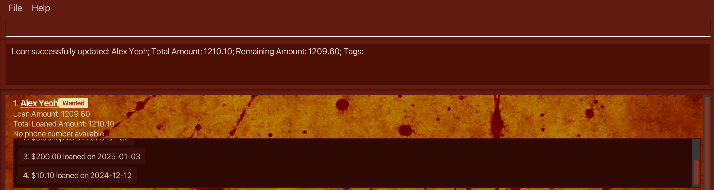

# Wanted User Guide

Wanted is a loan tracking application meant for personal use, for those of you who lend out money to others but find it difficult to keep track of what they owe you.

This guide assumes cursory knowledge of operating a Command Line Interface (CLI). In short, almost all actions in the program are performed by typing in a command in the specified formats below and pressing the Enter key.

The link to this guide can be found on the Github page or the Help window of the program.

## Value Proposition
With Wanted, you can
1. Track monetary loans by name
2. Repay loans in small amounts
3. View transaction history of borrowing and repayment
4. Do this all in a gritty, fun interface that resembles a Wanted poster!

<!-- * Table of Contents -->
<page-nav-print />

## Table of Contents

1. [Quickstart](#quick-start)
2. <a href="#tldr">I want a brief overview! TL;DR</a>
3. [Command Summary](#command-summary)
4. [Features](#features)
    1. [Help](#viewing-help-help)
    2. [Add](#adding-an-entry-add)
    3. [Rename](#renaming-an-entry-rename)
    4. [Phone](#addingupdating-phone-number-phone)
    5. [Tag](#addingupdating-tags-tag)
    6. [Increase](#adding-a-loan-increase)
    7. [Repay](#repaying-a-loan-repay)
    8. [Edithist](#editing-a-transaction-edithist)
    9. [Delhist](#deleting-a-transaction-delhist)
    10. [List](#listing-all-entries-list)
    11. [Find](#locating-entries-by-name-find)
    12. [Sort](#sorting-entries-sort)
    13. [Delete](#deleting-an-entry-delete)
    14. [Clear](#clearing-all-entries-clear)
    15. [Exit](#exiting-the-program-exit)
    16. [Save data](#saving-the-data)
    17. [Backup data file](#backing-up-data-files)
5. [Known Issues](#known-issues)

--------------------------------------------------------------------------------------------------------------------

## Quick Start

1. Ensure you have Java `17` or above installed in your Computer.<br>
   **Mac users:** Ensure you have the precise JDK version prescribed [here](https://se-education.org/guides/tutorials/javaInstallationMac.html).

1. Download the latest `.jar` file from [here](https://github.com/AY2425S2-CS2103T-F11-4/tp/releases).

1. Copy the file to the folder you want to use as the _home folder_ for your AddressBook.

1. Open a command terminal, `cd` into the folder you put the jar file in, and use the `java -jar wanted.jar` command to run the application.<br>
   A GUI similar to the below should appear in a few seconds. Note how the app contains some sample data.<br>
   

1. Type the command in the command box and press Enter to execute it. e.g. typing `help` and pressing Enter will open the help window.<br>
   Some example commands you can try:

    * `add n/John Doe` : Adds a new borrower named `John Doe` to the Wanted list.

    * `increase 1 l/19.87 d/2024-12-10` : Increases the amount borrowed by the 1st person in the current list and records the transaction in its loan history.
    
    * `repay 2 l/20.25 d/2025-01-01` : Decreases the amount borrowed by the 2nd person in the current list and records the transaction in its loan history.

    * `delete 3` : Deletes the 3rd person shown in the current list.

    * `clear` : Deletes all persons.

    * `exit` : Exits the app.

1. Refer to the [Features](#features) below for details of each command.

--------------------------------------------------------------------------------------------------------------------

[//]: # (somehow normal markdown notation disables links to this section, so using html notation)
<h2 id="tldr">TL;DR</h2>

___How do I track a loan?___<br>
Use the add command to add the loanee’s name to the list, then use the loan command to assign the amount loaned to that person’s entry.

___How do I track repayments?___<br>
Use the repay command when the loanee’s entry is visible on the list.

___How do I find an entry that I want to modify?___<br>
If you remember the loanee’s name, use the search command to find the loan. Otherwise, use the list command to sort by name
or the sort command to sort the list by total amount owed.

--------------------------------------------------------------------------------------------------------------------

## Command Summary

Command     | Action                           | Format, Examples
-----------|----------------------------------|-------------------------------------------------------------------------------------------------------------------------------------------------------------
**add**    | Add new entry                    |`add n/[NAME]`
**rename** | Change name of entry             | `rename [ID] n/[NAME]`
**phone** | Add/change phone number of entry | `phone [ID] p/[PHONE]`
**tag** | Add/change tags of entry         | `tag [ID] t/[TAG]…`
**increase** | Add a loan to entry              | `increase [ID] l/[AMOUNT] d/[DATE]`
**repay** | Add a repayment to entry         | `repay [ID] l/[AMOUNT] d/[DATE]`
**edithist**   | Edit a transaction in entry      |`edithist [ID] i/[TRANSACTION ID] (l/[AMOUNT]) (d/[DATE])`
**delhist** | Delete a transaction in entry    | `delhist [ID] i/[TRANSACTION ID]`
**list**   | List all entries                 |`list`
**find**   | Search entries by name           |`find [KEYWORD]…`
**delete** | Delete an entry                  |`delete [ID]`
**sort**   | Sort entries by loaned amount    |`sort`
**clear**  | Delete all entries               |`clear`
**help**   | Show help window                 |`help`
**exit**   | Exit the program                 |`exit`

--------------------------------------------------------------------------------------------------------------------

## Features

<box type="info" seamless>

**Notes about the command format:**<br>

* Words in square brackets and `UPPER_CASE` are the parameters to be supplied by the user.<br>
  e.g. in `add n/[NAME]`, `[NAME]` is a parameter which can be used as `add n/John Doe`.

* All command keywords are **case-sensitive**.<br>
  e.g. `add n/[NAME]` cannot be used as `Add n/[NAME]` or `add N/[name]`.

* Items in round brackets are optional.<br>
  e.g `(t/[TAG])` can be used as ` ` (empty string) or as `t/friend`.

* Items with `…` after them can be used multiple times.<br>
  e.g. `t/[TAG]…` can be used as `t/friend` or as `t/friend t/family`.

* Parameters can be in any order.<br>
  e.g. if the command specifies `l/[AMOUNT] d/[DATE]`, `d/[DATE] l/[AMOUNT]` is also acceptable.

* Extraneous parameters for commands that do not take in parameters (`help`, `list`, `sort`, `clear` and `exit`) will be ignored.<br>
  e.g. if the command specifies `help 123`, it will be interpreted as `help`.

* Extraneous whitespace before or after parameters will be ignored.<br>
  e.g. in `add n/[NAME]`, `add n/ John Doe ` will be interpreted as `add n/John Doe`.<br>
  Note that any whitespace within parameters are retained.

* If you are using a PDF version of this document, be careful when copying and pasting commands that span multiple lines as space characters surrounding line-breaks may be omitted when copied over to the application.
  </box>

### Viewing help: `help`

Shows a message explaining how to access the help page.


Format: `help`


### Adding an entry: `add`

Adds a new person as a new entry to the Wanted list.<br>

**Explanations:**
* This command adds a new entry starts with no money loaned and no money to be returned, no transaction history and no tags.
* This command does not accept names that already exist in the loanbook.

Format: `add n/[NAME]`

**Examples:**

<box>

**Scenario 1:** Adding a new entry<br>

**Input:** `add n/Cory Ander`<br>

**Output:**
```output 
New loan created for: Cory Ander; Total Amount: 0.00; Remaining Amount: 0.00; Tags: 
```
**Scenario 2:** Attempting to add an entry with the same name as another entry<br>
> **Note:** Assume Cory Ander exists at the first index.

**Input:** `add n/Cory Ander`<br>

**Output:**
```output 
This person has already loaned out money in the wanted list
```
</box>

### Renaming an entry: `rename`

Changes the name of the specified entry in the Wanted list.

Format: `rename [ID] n/[NAME]`

**Explanations:**
* This command allows you to modify the entry at the specified `ID`. The ID refers to the index number shown in the displayed person list.
* To update the entry's name, `NAME` must be alpha-numeric and non-empty
* If a name `n/[NAME]` is equal to the previous name or any other name in the loan book, the name will not be updated.

**Examples:**

<box>

**Scenario 1:** Renaming an entry<br>

**Input:** `rename 1 n/Cory Ander`<br>

**Output:**
```output 
Edited loan name: Cory Ander; Total Amount: 1210.10; Remaining Amount: 1209.60; Tags: 
```
**Scenario 2:** Renaming an entry with the same name<br>
> **Note:** Assume Cory Ander exists at the first index.

**Input:** `rename 1 n/Cory Ander`<br>

**Output:**
```output 
New name must be different from the old one.
```
**Scenario 3:** Renaming an entry with an existing name in the loanbook<br>

**Input:** `rename 1 n/David Li`<br>

**Output:**
```output 
This person already exists in the loan book.
```
</box>


### Adding/Updating phone number: `phone`

This command allows you to add and delete an entry's phone number in the Wanted list.

<box type="warning" seamless>
Warning: An empty phone p/ will clear the entries' phone number
</box>

Format: `phone [ID] p/[PHONE]`

**Explanations:**
* This command allows you to modify the entry at the specified `ID`. The ID refers to the index number shown in the displayed person list.
* To add or update a phone number, `PHONE` must be a new number and non-empty 
* If a phone number `p/[PHONE]` is equal to the previous phone number, the entry will not be updated

**Examples:**

<box>

**Scenario 1:** Adding a new phone number<br>

**Input:** `phone 1 t/98765432`<br>

**Output:**
```output 
Phone number successfully updated: Alex Yeoh; Total Amount: 1200.00; Remaining Amount: 1199.50; Tags: 
```
**Scenario 2:** Deleting a phone number<br>

**Input:** `phone 1 p/`<br>

**Output:**
```output 
This loan now has no phone number: Alex Yeoh; Total Amount: 1200.00; Remaining Amount: 1199.50; Tags:
```

**Scenario 3:** Attempting to add multiple phone numbers<br>
> **Note:** This command will only execute when there is one prefix `p/[PHONE]`

**Input:** `phone 1 p/98765432 p/`<br>

**Output:**
```output 
Multiple values specified for the following single-valued field(s): p/
```
**Scenario 4:** Attempting to update an identical phone numbers<br>

**Input:** `phone 2 p/20242025`<br>

**Output:**
```output 
New phone number must be different than the old one
```
</box>


### Adding/Updating tags: `tag`

This command allows you to add or delete tag descriptors to each entry

<box type="tip" seamless>
Tip: A person can have any number of tags (including 0)<br>
</box>
<box type="warning" seamless>
Warning: An empty tag t/ will clear all tags
</box>

Format: `tag [ID] t/[TAG]…`

**Explanations:**
* This command allows you to modify the entry at the specified `ID`. The ID refers to the index number shown in the displayed person list.
* To add a Tag, `TAG` must be non-empty, unique to the tag list, and case-insensitive. 
<br>When adding multiple tags in a single command: 
    - The system checks if all tags in your command already exist in the tag list (case-insensitive)
    - If all tags are already present, no edit will occur
    - If at least one tag is new, then only the unique tags will be added to the list
* If a `TAG` is empty e.g. `t/` all tags will be deleted

**Examples:**

<box>

**Scenario 1:** Adding a new tag<br>

**Input:** `tag 1 t/schoolmate`<br>

**Output:**
```output 
Edited loan name: Anna Sue; Total Amount: 100.00; Remaining Amount: 80.00; Tags: [schoolmate]
```
**Scenario 2:** Adding a duplicate tag<br>

> **Note:** Assuming the tag schoolmate already exists. If a tag which does not exist in the current tag list such as `t/home`
> is added the command will return successfully

**Input:** `tag 1 t/schoolmate` <br>

**Output:** 
```output
Your requested tag(s) already exist(s) for this person
```
**Scenario 3:** Add a tag<br>

> **Note:** Assuming the tag schoolmate already exists.

**Input:** `tag 1 t/CS2103` <br>

**Output:**
```output
Edited loan tags: Anna Sue; Total Amount: 100.00; Remaining Amount: 80.00; Tags: [schoolmate][CS2103]
```

**Scenario 4:** Add multiple tags<br>

> **Note:** Assuming the tags schoolmate and CS2103 already exists. Please scroll to see the entire output.

**Input:** `tag 1 t/owesALot t/shopaholic` <br>

**Output:**
```output
Edited loan tags: Anna Sue; Total Amount: 100.00; Remaining Amount: 80.00; Tags: [schoolmate][CS2103][owesALot][shopaholic]
```
**Scenario 5:** Delete all tags

**Input:** `tag 1 t/`<br>

**Output:**
```output
Edited loan name: Anna Sue; Total Amount: 100.00; Remaining Amount: 80.00; Tags:
```

**Scenario 6:** Add and delete tags in one command failure
> **Note:** To delete a tag please input only t/ as per scenario 5

**Input:** `tag 1 t/ t/newtag` or `tag 1 t/newtag t/` <br>

**Output:**
```output
Tags names should be alphanumeric
```
</box>

### Adding a loan: `increase`

This command lets you record an increase in the loan amount for a specific entry, and saves it as a transaction in the entry's transaction history.

Format: `increase [ID] l/[AMOUNT] d/[DATE]`

Explanations:
* You can add an increase transaction to the entry at the specified ID. The ID refers to the index number shown in the displayed person list
* The increase command records a new transaction, and can be observed in your entry's transaction history

**Example:**

<box>

**Scenario:** Adding a new increase transaction<br>

**Input:** `increase 1 l/10.10 d/2024-12-12`<br>

**Output:**
```output 
Loan successfully updated: Alex Yeoh; Total Amount: 1210.10; Remaining Amount: 1209.60; Tags:
```
</box>



### Repaying a loan: `repay`

Adds a transaction indicating that the specified amount was returned at the specified date to an entry.

Format: `repay [ID] l/[AMOUNT] d/[DATE]`

Explanations:
* Modifies the entry at the specified `ID`. The index refers to the index number shown in the displayed person list. The index **must be a positive integer** 1, 2, 3, …
* Loaned amount must be a non-negative numeric value with 2 decimal places.
* Date must be in the format YYYY-MM-DD.

### Editing a transaction: `edithist`

Edits an existing transaction in the transaction history of an entry.

Format: `edithist [ID] i/[TRANSACTION ID] (l/[AMOUNT]) (d/[DATE])`

Explanation:
* `[ID]` is the index number of the specified entry in the displayed persons list.
* `[TRANSACTION ID]` is the index number of the edited transaction in the displayed transaction history of the specified entry.
* If `[AMOUNT]` is supplied, the amount of the specified transactions is replaced by the supplied amount.
* If `[DATE]` is supplied, the date of the specified transactions is replaced by the supplied date.

Restrictions:
* `[ID]` must be a positive integer between 1 and the number of entries in the Wanted list.
* `[TRANSACTION ID]` must be a positive integer between 1 and the number of recorded transactions in the specified entry.
* `[AMOUNT]` must be a non-negative numeric value with **exactly** 2 decimal places.
* `[DATE]` must be in the format YYYY-MM-DD.
* This edition must not result in a negative remaining loan balance at any point in the history.

### Deleting a transaction: `delhist`

Deletes an existing transaction in the transaction history of an entry.

Format: `delhist [ID] i/[TRANSACTION ID]`

Explanation:
* `[ID]` is the index number of the specified entry in the displayed persons list.
* `[TRANSACTION ID]` is the index number of the deleted transaction in the displayed transaction history of the specified entry.

Restrictions:
* `[ID]` must be a positive integer between 1 and the number of entries in the Wanted list.
* `[TRANSACTION ID]` must be a positive integer between 1 and the number of recorded transactions in the specified entry.
* This deletion must not result in a negative remaining loan balance at any point in the history.

### Listing all entries: `list`

Shows a list of all entries in the Wanted list.

Format: `list`

### Locating entries by name: `find`

Finds entries whose names contain any of the given keywords.

Format: `find [KEYWORD]...`

* The search is case-insensitive. e.g `hans` will match `Hans`
* The order of the keywords does not matter. e.g. `Hans Bo` will match `Bo Hans`
* Only the name is searched.
* Only full words will be matched e.g. `Han` will not match `Hans`
* Persons matching at least one keyword will be returned at the top of the Wanted list(i.e. `OR` search).
  e.g. `Hans Bo` will return `Hans Gruber`, `Bo Yang`

Examples:
* `find John` returns entries with borrower names `john` and `John Doe`
* `find alex david` returns entries with borrower names `Alex Yeoh`, `David Li`<br>
  [TODO: update image below]
  

### Sorting entries: `sort`

Sorts the Wanted list by loaned amount.

Format: `sort`

### Deleting an entry: `delete`

Deletes the specified entry from the loan book.

<box type="warning" seamless>
Warning: The list, sort, and find commands change the ID's of each entry. So, be cautious when deleting
an entry after running any of these commands.
</box>

Format: `delete [ID]`

**Explanations:**

* Deletes the person at the specified `ID`.
* The `ID` refers to the index number shown in the displayed persons list.

**Example:**

<box>

**Scenario:** Deleting an entry<br>

**Input:** `delete 2`<br>

**Output:**
```output 
Deleted Loan: Bernice Yu; Total Amount: 40.49; Remaining Amount: 40.49; Tags: [colleagues][friends]
```
</box>

### Clearing all entries: `clear`

Clears all entries from the loan book.

<box type="warning" seamless>
Warning: No undo for clear command. All loan entries will be wiped.
</box>

Format: `clear`

### Exiting the program: `exit`

Exits the program.

Format: `exit`

### Saving the data

Wanted saves the Wanted list after each operation that modifies it. There is no need to save manually.

### Backing up data files

Wanted data is saved automatically as a JSON file `[JAR file location]/data/loanbook.json`. Copy this file to another folder to create a backup.

### Transferring data across devices

If you wish to transfer your saved data to another device, install Wanted on the new device and replace the JSON data file in `[JAR file location]/data/loanbook.json` with the data file from the old device.

--------------------------------------------------------------------------------------------------------------------

## Known Issues

1. **When using multiple screens**, if you move the application to a secondary screen, and later switch to using only
the primary screen, the GUI will open off-screen. The remedy is to delete the `preferences.json` file created by the
application before running the application again.
2. **If you minimize the Help Window** and then run the `help` command (or use the `Help` menu, or the keyboard shortcut `F1`)
again, the original Help Window will remain minimized, and no new Help Window will appear. The remedy is to manually restore the minimized Help Window.
3. **If your tags overlap with an entry's name**, then download the
[Special Elite font](https://fonts.google.com/specimen/Special+Elite) and place it in src/main/resources/fonts
